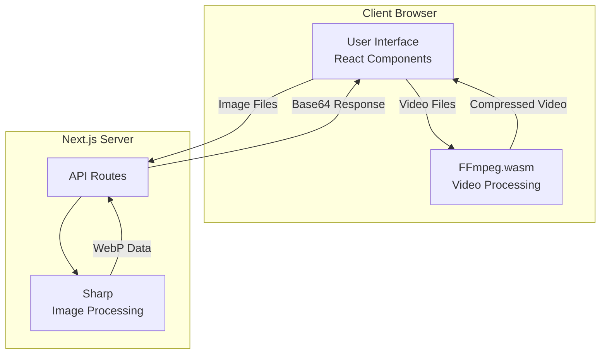
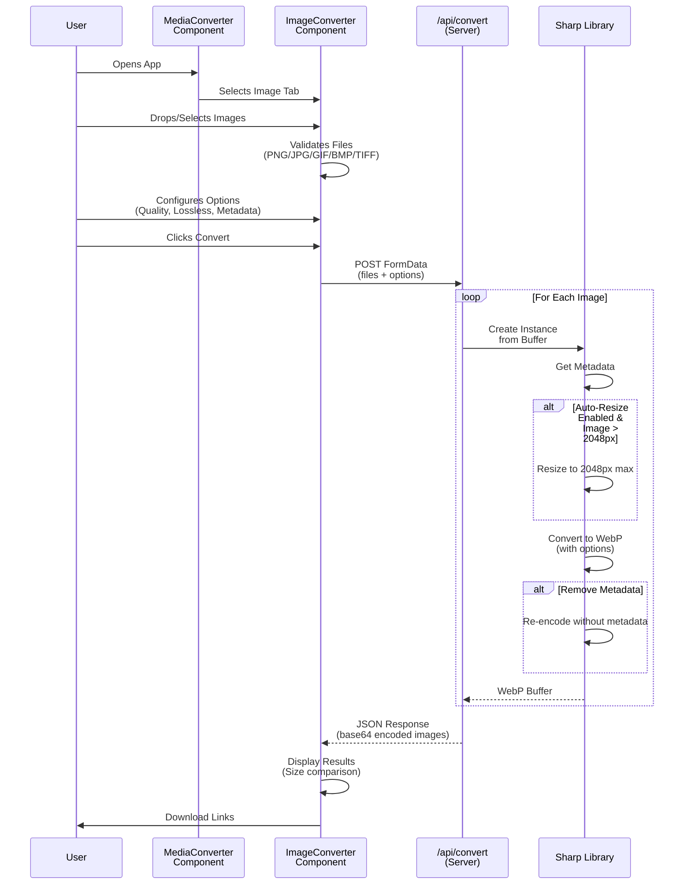
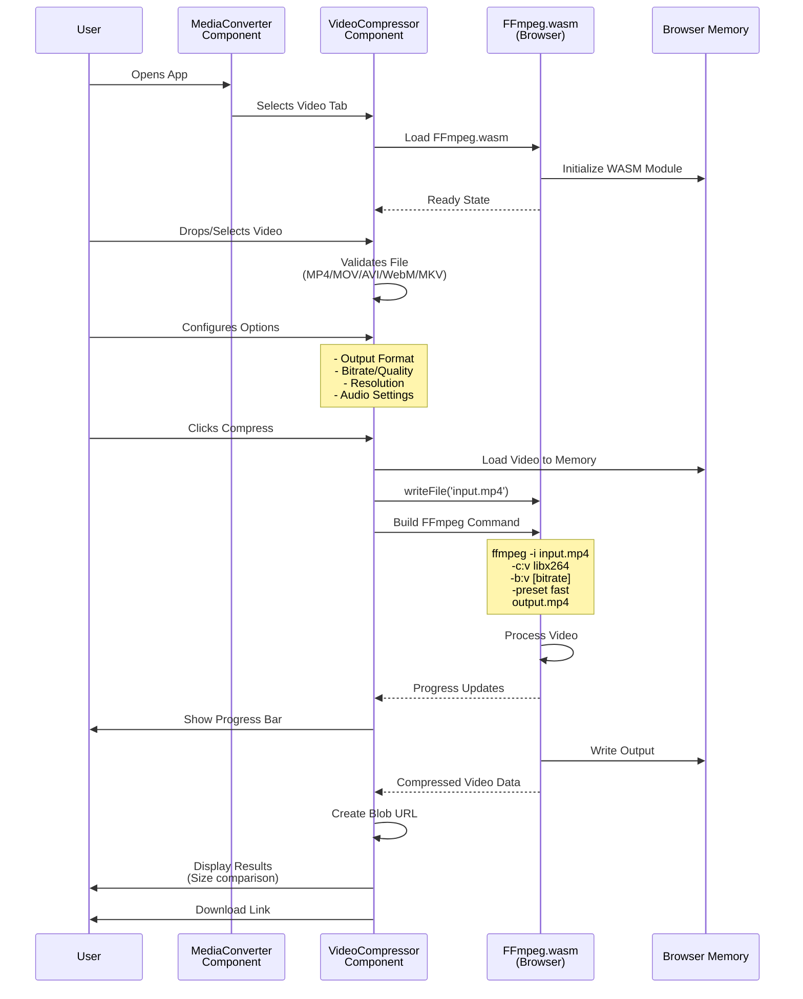
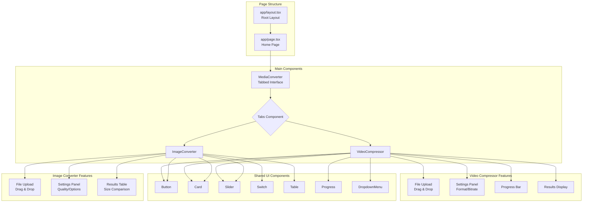
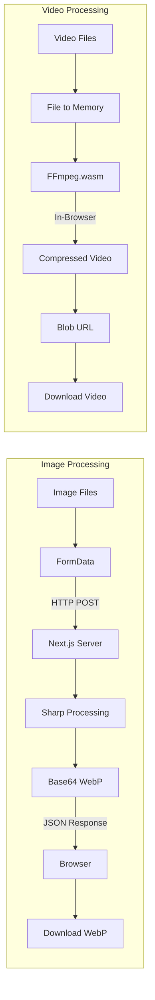

# Media Optimizer - Architecture Flow Diagram

## System Overview



## Image Conversion Flow (Server-Side)



## Video Compression Flow (Client-Side)



## Component Architecture



## Data Flow



## Key Technical Components

### Headers Configuration (next.config.ts)
```
COOP: same-origin
COEP: require-corp
```
Required for SharedArrayBuffer support in FFmpeg.wasm

### Webpack Polyfills
- `process` → 'process/browser'
- `Buffer` → ['buffer', 'Buffer']
- `node:` imports → browser equivalents

### File Size Limits
- Images: Handled by Sharp (server memory dependent)
- Videos: Limited by browser memory (typically 2GB max)

### Performance Characteristics
- **Image Conversion**: ~100-500ms per image (server-side)
- **Video Compression**: 1-10 minutes depending on size/settings (client-side)
- **Batch Processing**: Parallel for images, sequential for videos